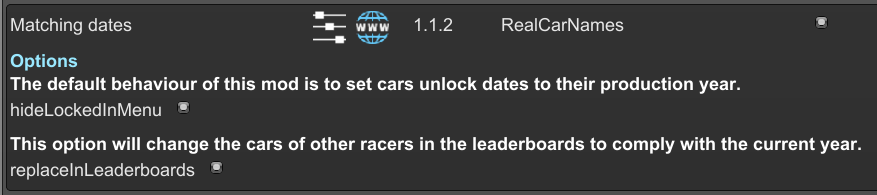
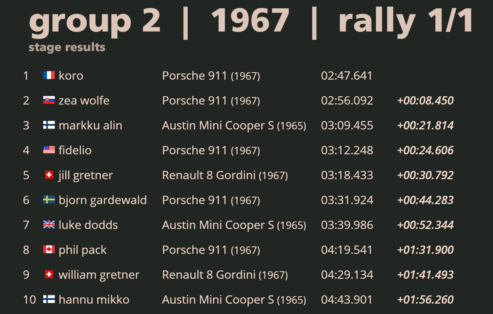

# Matching dates

A mod for Art of Rally that blocks some cars from being used in career mode if they haven't been invented yet.

#### Launcher Support

#### Platform Support

## Requirements

This mod requires the "Real car names" that you can find [here](https://github.com/MMike17/ArtOfRally_RealCarNames).\
Latest release 

## Usage

Press `CTRL + F10` to bring up the mod menu.\
<!-- Adjust settings to select what name format you want.

"Original" is the default name of the car.\
"Real" is the real name of the car.\
"Year" is the year of the model.

If the mod is disabled, the regular game names are displayed by default. -->

<!-- ## Disclaimer

UI hot reload no longer works.\
Please make sure to set the mod settings before entering menus where the car names are retrieved. -->

## Installation

Follow the [installation guide](https://www.nexusmods.com/site/mods/21/) of
the Unity Mod Manager.\
Then simply download the [latest release](https://github.com/MMike17/ArtOfRally_MatchingDates/releases/latest)
and drop it into the mod manager's mods page.

## Showcase

<!--  -->
<!--  -->
<!--  -->

## Acknowledgments

- Thanks to [Theaninova](https://github.com/Theaninova) who's mods I've used as a base layer.
- Thanks to [Nexus Mod Manager](https://wiki.nexusmods.com/index.php/How_to_create_mod_for_unity_game) for the tutorial on how to make mods for UnityModManager.