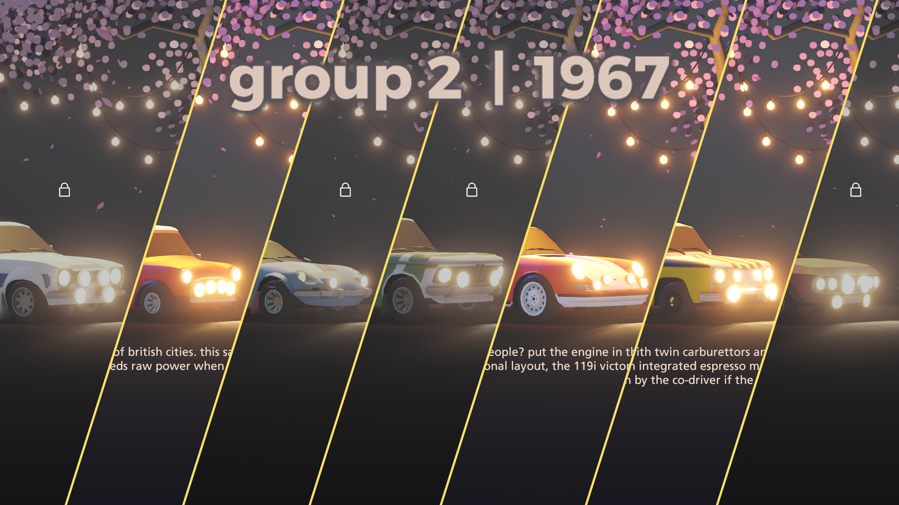
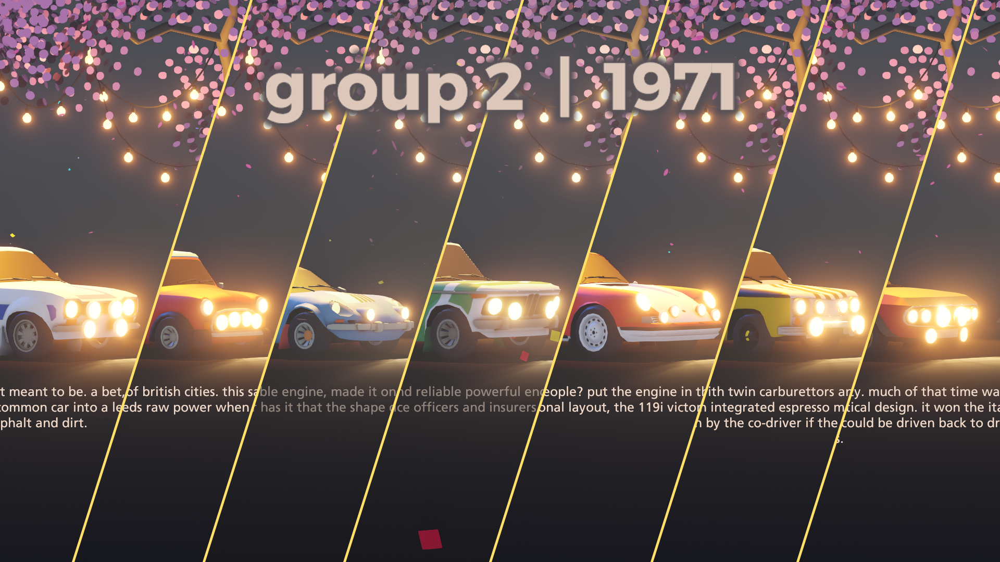

# Matching dates

A mod for Art of Rally that locks cars from being used in career mode if they haven't been produced yet.

#### Launcher Support

#### Platform Support

## Requirements

This mod requires the "Real car names" that you can find [here](https://github.com/MMike17/ArtOfRally_RealCarNames).\
Latest release 

## Usage

Press Ctrl + F10 to open the mod manager menu.\
Adjust settings to select what lock method you want.\
By default, the mod locks every car to their production year in career mode.

"hideLockedInMenu" will hide locked cars in the car selection menu.\
"replaceInLeaderboards" will make sure all racers in the rally will have unlocked cars.

Disabling the mod in the manager will restore the original unlock conditions by default.\
If no cars are available for a season, the mod will default to enableing all cars.

## Disclaimer

There is no UI hot reload.\
Please enable this mod and change settings **before** entering the career menu.

This mod might lock some cars out of career mode entirely.

## Installation

Follow the [installation guide](https://www.nexusmods.com/site/mods/21/) of
the Unity Mod Manager.\
Then simply download the [latest release](https://github.com/MMike17/ArtOfRally_MatchingDates/releases/latest)
and drop it into the mod manager's mods page.

## Showcase

## Acknowledgments

- Thanks to [Theaninova](https://github.com/Theaninova) who's mods I've used as a base layer.
- Thanks to [Nexus Mod Manager](https://wiki.nexusmods.com/index.php/How_to_create_mod_for_unity_game) for the tutorial on how to make mods for UnityModManager.